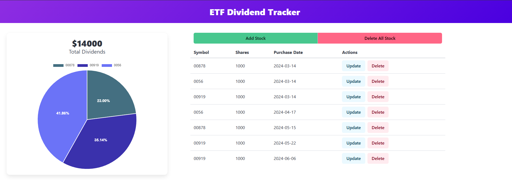

# ETF-Dashboard

## Introduction
> This is a dashboard for calculating the dividends I can receive from my ETF holdings. Since each ETF has a different dividend payout schedule, manually tracking the number of shares and calculating the dividends for each period is cumbersome. Therefore, I created this tool to automate the process.

## Web Preview

